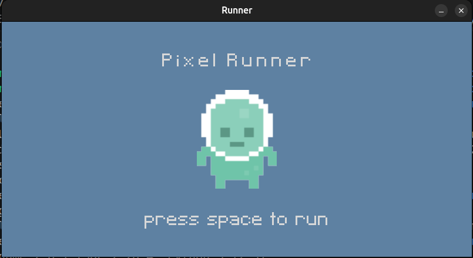
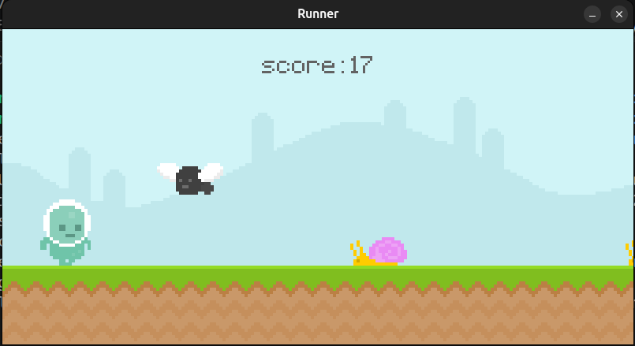

# Pixel Runner

## About

**Pixel Runner** is my first Pygame project. 

## Screenshots





## Getting Started

To run this project, install the required dependencies:

```bash
pip install -r requirements.txt
```

Then run the game:

```bash
python runner.py
```

## Project Structure

- `runner.py` - Main game file
- `graphics/` - Game sprite assets (player, snail, fly)
- `audio/` - Sound files
- `font/` - Font files
- `ss/` - Screenshot outputs

Built by following 
    [this YouTube tutorial](https://www.youtube.com/watch?v=AY9MnQ4x3zk&t=4812s).